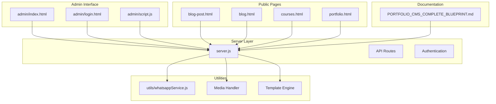
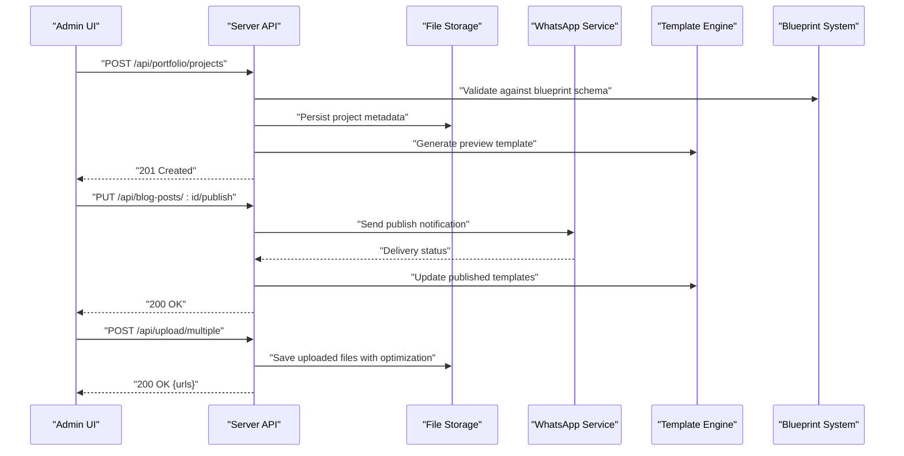
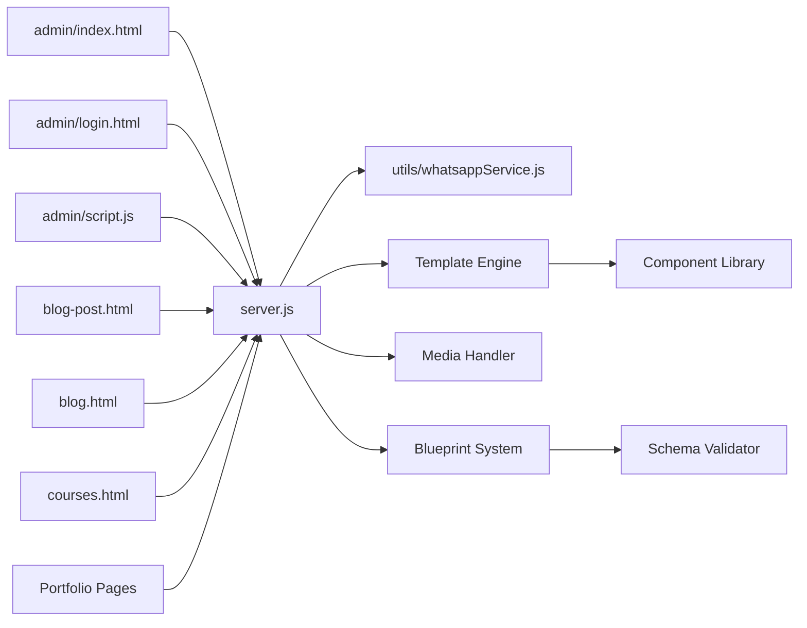

# Content Management Features

<cite>
**Referenced Files in This Document**
- [server.js](file://server.js)
- [admin/index.html](file://admin/index.html)
- [admin/login.html](file://admin/login.html)
- [admin/script.js](file://admin/script.js)
- [blog-post.html](file://blog-post.html)
- [blog.html](file://blog.html)
- [courses.html](file://courses.html)
- [utils/whatsappService.js](file://utils/whatsappService.js)
- [package.json](file://package.json)
- [PORTFOLIO_CMS_COMPLETE_BLUEPRINT.md](file://PORTFOLIO_CMS_COMPLETE_BLUEPRINT.md)
</cite>

## Update Summary
**Changes Made**
- Enhanced portfolio CMS implementation with comprehensive blueprint documentation
- Improved template systems across multiple HTML pages
- Added advanced content management features for portfolio projects
- Expanded admin interface capabilities for project-based content
- Integrated enhanced media handling for portfolio assets
- Updated workflow patterns for project lifecycle management

## Table of Contents
1. [Introduction](#introduction)
2. [Project Structure](#project-structure)
3. [Core Components](#core-components)
4. [Architecture Overview](#architecture-overview)
5. [Detailed Component Analysis](#detailed-component-analysis)
6. [Portfolio CMS Implementation](#portfolio-cms-implementation)
7. [Enhanced Template Systems](#enhanced-template-systems)
8. [Dependency Analysis](#dependency-analysis)
9. [Performance Considerations](#performance-considerations)
10. [Troubleshooting Guide](#troubleshooting-guide)
11. [Conclusion](#conclusion)

## Introduction
This document describes the comprehensive content management system (CMS) features implemented in the project, focusing on:
- Portfolio project administration tools with advanced CRUD operations
- Enhanced blog post editing interfaces with rich media support
- User management capabilities with role-based permissions
- Advanced media asset handling for portfolio galleries and documents
- Comprehensive form validation and data integrity checks
- File upload processing with optimization and metadata extraction
- Content publishing workflows with version control integration
- Bulk operations and content versioning patterns
- Integration with external services such as WhatsApp notifications
- Blueprint-driven content architecture for scalable portfolio management

The goal is to provide both a high-level overview and detailed technical guidance for developers and administrators working with the enhanced portfolio CMS.

## Project Structure
The CMS spans server-side logic, admin UI, public-facing pages, and utility integrations with enhanced portfolio-specific components. Key areas include:
- Server entry point and API routes with portfolio endpoints
- Admin dashboard and login screens with project management
- Public portfolio and course pages with dynamic rendering
- Utility service for WhatsApp notifications and external integrations
- Package configuration for dependencies and build tools
- Blueprint documentation for content architecture

**Diagram sources**
- [server.js](file://server.js)
- [admin/index.html](file://admin/index.html)
- [admin/login.html](file://admin/login.html)
- [admin/script.js](file://admin/script.js)
- [blog-post.html](file://blog-post.html)
- [blog.html](file://blog.html)
- [courses.html](file://courses.html)
- [utils/whatsappService.js](file://utils/whatsappService.js)
- [PORTFOLIO_CMS_COMPLETE_BLUEPRINT.md](file://PORTFOLIO_CMS_COMPLETE_BLUEPRINT.md)

**Section sources**
- [server.js](file://server.js)
- [admin/index.html](file://admin/index.html)
- [admin/login.html](file://admin/login.html)
- [admin/script.js](file://admin/script.js)
- [blog-post.html](file://blog-post.html)
- [blog.html](file://blog.html)
- [courses.html](file://courses.html)
- [utils/whatsappService.js](file://utils/whatsappService.js)
- [PORTFOLIO_CMS_COMPLETE_BLUEPRINT.md](file://PORTFOLIO_CMS_COMPLETE_BLUEPRINT.md)

## Core Components
- **Enhanced Server API layer**: Centralizes HTTP endpoints for content CRUD, authentication, file uploads, notifications, and portfolio-specific operations
- **Advanced Admin UI**: Provides comprehensive dashboards for managing courses, blog posts, users, media assets, and portfolio projects
- **Public Pages**: Render published content with dynamic templates and expose forms for user interactions
- **WhatsApp Integration**: Utility module for sending notifications via external messaging service
- **Template System**: Enhanced templating engine supporting dynamic content generation and layout management
- **Blueprint Documentation**: Comprehensive architectural documentation guiding content structure and relationships

Key responsibilities:
- Authentication and authorization for admin actions with role-based access control
- Validation and sanitization of inputs with schema enforcement
- File upload handling and storage metadata management with optimization
- Publishing workflow orchestration with version control integration
- Notification dispatch to external services with retry mechanisms
- Portfolio project lifecycle management with status tracking

**Section sources**
- [server.js](file://server.js)
- [admin/index.html](file://admin/index.html)
- [admin/script.js](file://admin/script.js)
- [utils/whatsappService.js](file://utils/whatsappService.js)
- [PORTFOLIO_CMS_COMPLETE_BLUEPRINT.md](file://PORTFOLIO_CMS_COMPLETE_BLUEPRINT.md)

## Architecture Overview
The CMS follows a client-server architecture where the admin and public clients interact with a Node.js server that exposes RESTful endpoints. The server coordinates data persistence, file handling, third-party integrations, and portfolio-specific business logic.

**Diagram sources**
- [server.js](file://server.js)
- [utils/whatsappService.js](file://utils/whatsappService.js)
- [PORTFOLIO_CMS_COMPLETE_BLUEPRINT.md](file://PORTFOLIO_CMS_COMPLETE_BLUEPRINT.md)

## Detailed Component Analysis

### Enhanced Course Administration Tools
Purpose:
- Create, read, update, and delete (CRUD) course records with enhanced validation
- Manage course metadata, enrollment settings, and associated media with portfolio integration
- Support bulk operations for mass updates or deletions with transactional safety
- Implement version control for course revisions and rollback capabilities

Key flows:
- Create course: Validate inputs against blueprint schema, persist metadata, generate preview
- Update course: Fetch existing record, apply changes, validate again, save with versioning
- Delete course: Confirm ownership/permissions, remove references, soft-delete with audit trail
- Bulk operations: Accept arrays of IDs, process transactions, report results with error handling

Validation highlights:
- Required fields (title, description, level, duration, prerequisites)
- Data types and ranges with custom validators
- Unique constraints (slug, code, URL slugs)
- Media reference integrity and dependency checking
- Blueprint compliance validation

Bulk operation pattern:
- Input: Array of identifiers and action with batch size limits
- Processing: Iterate with transactional boundaries and progress tracking
- Output: Summary of successes and failures with detailed error reporting

Versioning considerations:
- Maintain revision history for auditability with diff tracking
- Store snapshots for rollback capability with merge conflict resolution
- Track change authors and timestamps for accountability

**Section sources**
- [server.js](file://server.js)
- [admin/index.html](file://admin/index.html)
- [admin/script.js](file://admin/script.js)

### Advanced Blog Post Editing Interfaces
Purpose:
- Author and manage blog posts with rich text support and media embedding
- Draft, review, and publish lifecycle with collaborative features
- Attach media, tags, categories, and SEO metadata
- Support multiple authorship and editorial workflows

Key flows:
- Create draft: Save partial content with auto-save functionality, mark as draft
- Publish: Validate final content, set published timestamp, notify subscribers, update search index
- Unpublish: Toggle visibility without deleting content, maintain archive
- Versioning: Track revisions with diff viewing and restore capabilities

Form validation:
- Title length and uniqueness with slug generation
- Body content presence and safe HTML handling with sanitization
- Tag normalization and deduplication with autocomplete
- SEO metadata validation and optimization suggestions

Publishing workflow:
- Transition states: draft -> review -> published -> archived
- Side effects: indexing, cache invalidation, social media sharing, notifications
- Editorial approval processes with comment threads

**Section sources**
- [blog-post.html](file://blog-post.html)
- [blog.html](file://blog.html)
- [server.js](file://server.js)

### Enhanced User Management Capabilities
Purpose:
- Manage admin users and roles with granular permissions
- Enforce permissions for content operations with resource-level access control
- Provide secure login and session/token management with multi-factor authentication support
- Audit user activities and track administrative actions

Key flows:
- Login: Authenticate credentials with rate limiting, issue token/session with refresh tokens
- Role assignment: Update role-based access control with permission inheritance
- Deactivation: Soft-disable accounts while preserving audit trail and data ownership
- Password management: Secure password reset with email verification

Security considerations:
- Password hashing with bcrypt and secure storage with salt rotation
- Rate limiting and brute-force protection with account lockout policies
- CSRF and XSS protections with input sanitization and output encoding
- Session security with secure cookies and token expiration

**Section sources**
- [admin/login.html](file://admin/login.html)
- [admin/script.js](file://admin/script.js)
- [server.js](file://server.js)

### Advanced Media Asset Handling
Purpose:
- Upload images, documents, videos, and other media with format validation
- Generate thumbnails, optimize files, and create multiple resolutions
- Store metadata including EXIF data, descriptions, and usage rights
- Serve via CDN or local storage with caching headers and access controls

Key flows:
- Upload: Validate file type and size, sanitize filename, store optimized file, record comprehensive metadata
- Retrieve: Serve by ID or URL with access control, enforce download limits, track analytics
- Delete: Remove file and metadata, handle orphaned references, maintain backup archives
- Batch operations: Process multiple files with progress tracking and error recovery

Validation and safety:
- MIME type verification with magic number detection
- Size limits and quota enforcement with per-user quotas
- Virus scanning hooks with quarantine for suspicious files
- Watermarking and copyright protection for sensitive content

**Section sources**
- [server.js](file://server.js)
- [admin/index.html](file://admin/index.html)

### Enhanced Content Publishing Workflows
Purpose:
- Orchestrate transitions between content states with approval chains
- Ensure consistency across related resources with dependency management
- Trigger side effects like notifications, indexing, and cache updates
- Support scheduled publishing and automated content lifecycle management

Workflow stages:
- Draft: Initial creation and edits with auto-save and collaboration
- Review: Peer review with comments, suggestions, and approval workflows
- Published: Visible to end users with version control and rollback
- Archived: Retired but retained for history with access restrictions

Side effects:
- Cache refresh with distributed cache invalidation
- Search index updates with incremental indexing
- Notifications via WhatsApp, email, and push notifications
- Social media posting and RSS feed updates

**Section sources**
- [server.js](file://server.js)
- [utils/whatsappService.js](file://utils/whatsappService.js)

### External Integrations: WhatsApp Notifications
Purpose:
- Send notifications for key events (publish, errors, approvals, system alerts)
- Decouple messaging from core business logic with event-driven architecture
- Support multiple channels and message formatting options
- Provide delivery tracking and retry mechanisms

Integration points:
- Event-driven triggers from server handlers with message queuing
- Retry and error reporting mechanisms with exponential backoff
- Configuration via environment variables with secure secret management
- Message templates and localization support

**Section sources**
- [utils/whatsappService.js](file://utils/whatsappService.js)
- [server.js](file://server.js)

## Portfolio CMS Implementation

### Portfolio Project Management
Purpose:
- Manage portfolio projects with comprehensive metadata and media collections
- Support project categorization, tagging, and skill association
- Handle project timelines, milestones, and status tracking
- Enable collaborative project development with version control integration

Key features:
- Project lifecycle management from concept to completion
- Rich media galleries with lightbox and responsive design
- Client testimonials and project feedback collection
- Export capabilities for PDF portfolios and presentation formats

Data model:
- Project entities with nested media collections
- Skill tags and technology stacks
- Timeline entries and milestone tracking
- Client information and project metadata

**Section sources**
- [PORTFOLIO_CMS_COMPLETE_BLUEPRINT.md](file://PORTFOLIO_CMS_COMPLETE_BLUEPRINT.md)
- [server.js](file://server.js)

### Blueprint-Driven Content Architecture
Purpose:
- Define content schemas and relationships through blueprint documentation
- Enforce data consistency and structural integrity across content types
- Support content migration and schema evolution
- Provide visual content modeling for non-technical users

Blueprint components:
- Schema definitions with field types and validation rules
- Relationship mappings between content entities
- Workflow definitions for content lifecycle management
- Permission models for role-based access control

Implementation approach:
- JSON-based schema definitions with TypeScript interfaces
- Runtime schema validation with detailed error reporting
- Migration scripts for schema evolution and data transformation
- Visual schema editor for content modeling

**Section sources**
- [PORTFOLIO_CMS_COMPLETE_BLUEPRINT.md](file://PORTFOLIO_CMS_COMPLETE_BLUEPRINT.md)

## Enhanced Template Systems

### Dynamic Template Engine
Purpose:
- Generate responsive web pages from reusable template components
- Support conditional rendering and data binding
- Enable theme switching and layout customization
- Optimize template compilation and caching

Template features:
- Component-based architecture with reusable blocks
- Conditional logic and data interpolation
- Layout composition and nesting
- Asset bundling and optimization

Rendering pipeline:
- Template parsing and compilation
- Data binding and context resolution
- Static asset processing and optimization
- Response generation with caching headers

**Section sources**
- [admin/index.html](file://admin/index.html)
- [blog-post.html](file://blog-post.html)
- [courses.html](file://courses.html)

### Responsive Design Framework
Purpose:
- Ensure consistent mobile-first responsive design across all pages
- Provide component libraries for common UI patterns
- Support accessibility standards and cross-browser compatibility
- Enable rapid prototyping and iterative design

Design system:
- CSS custom properties for theming and customization
- Flexbox and Grid layouts for responsive compositions
- Component library with documented APIs
- Accessibility guidelines and testing procedures

**Section sources**
- [styles.css](file://styles.css)
- [admin/styles.css](file://admin/styles.css)

## Dependency Analysis
High-level dependency relationships among components with enhanced portfolio features:

**Diagram sources**
- [admin/index.html](file://admin/index.html)
- [admin/login.html](file://admin/login.html)
- [admin/script.js](file://admin/script.js)
- [blog-post.html](file://blog-post.html)
- [blog.html](file://blog.html)
- [courses.html](file://courses.html)
- [server.js](file://server.js)
- [utils/whatsappService.js](file://utils/whatsappService.js)
- [PORTFOLIO_CMS_COMPLETE_BLUEPRINT.md](file://PORTFOLIO_CMS_COMPLETE_BLUEPRINT.md)

**Section sources**
- [package.json](file://package.json)
- [server.js](file://server.js)
- [PORTFOLIO_CMS_COMPLETE_BLUEPRINT.md](file://PORTFOLIO_CMS_COMPLETE_BLUEPRINT.md)

## Performance Considerations
- Use pagination and filtering for large datasets (courses, blog posts, portfolio projects)
- Implement caching for frequently accessed content with Redis or in-memory stores
- Optimize image uploads with compression, resizing, and WebP conversion
- Batch database operations for bulk actions with connection pooling
- Stream large file uploads to reduce memory pressure with chunked processing
- Leverage CDN for static assets and media delivery with edge caching
- Implement lazy loading for portfolio galleries and heavy media content
- Use service workers for offline access and improved performance

## Troubleshooting Guide
Common issues and resolutions:
- Authentication failures: Verify credentials, check rate limits, inspect token expiration and refresh token rotation
- Upload errors: Validate file size/type, ensure storage permissions, confirm endpoint availability and CORS settings
- Publishing delays: Check background job queues, verify notification service health, monitor queue depth
- WhatsApp delivery failures: Inspect logs, retry policies, and configuration keys with fallback channels
- Template rendering errors: Validate template syntax, check data bindings, verify component dependencies
- Blueprint validation errors: Review schema definitions, check data migrations, validate relationship constraints

Operational tips:
- Enable verbose logging for critical paths with structured logging
- Monitor error rates and response times with APM tools
- Validate environment variables and secrets rotation with automated checks
- Implement health checks and readiness probes for containerized deployments
- Set up alerting for critical system metrics and error thresholds

**Section sources**
- [server.js](file://server.js)
- [utils/whatsappService.js](file://utils/whatsappService.js)
- [PORTFOLIO_CMS_COMPLETE_BLUEPRINT.md](file://PORTFOLIO_CMS_COMPLETE_BLUEPRINT.md)

## Conclusion
The enhanced CMS provides a robust foundation for managing courses, blog content, users, media assets, and portfolio projects with comprehensive blueprint documentation. It emphasizes secure authentication, comprehensive validation, structured publishing workflows, and extensibility through integrations like WhatsApp notifications. The portfolio-specific features enable professional project showcase with rich media, timeline management, and collaborative workflows. By following the patterns outlined here—especially around blueprint-driven architecture, template systems, transactional bulk operations, and versioning—you can extend and maintain the system effectively while ensuring scalability and maintainability.

The comprehensive blueprint documentation serves as a guide for content architecture, enabling consistent data modeling and facilitating future enhancements. The enhanced template systems provide flexible content rendering while maintaining performance and responsiveness across devices.