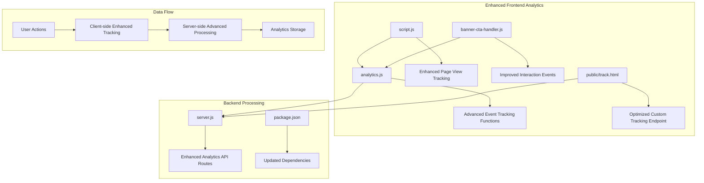
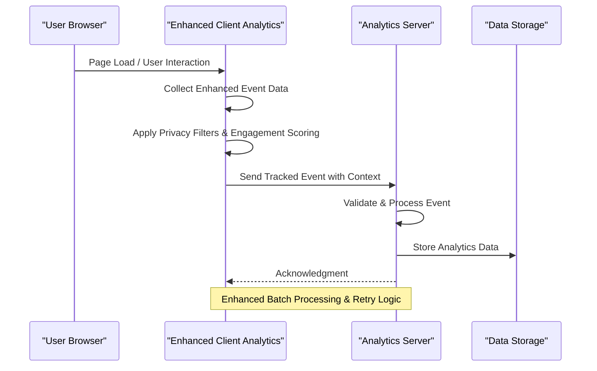
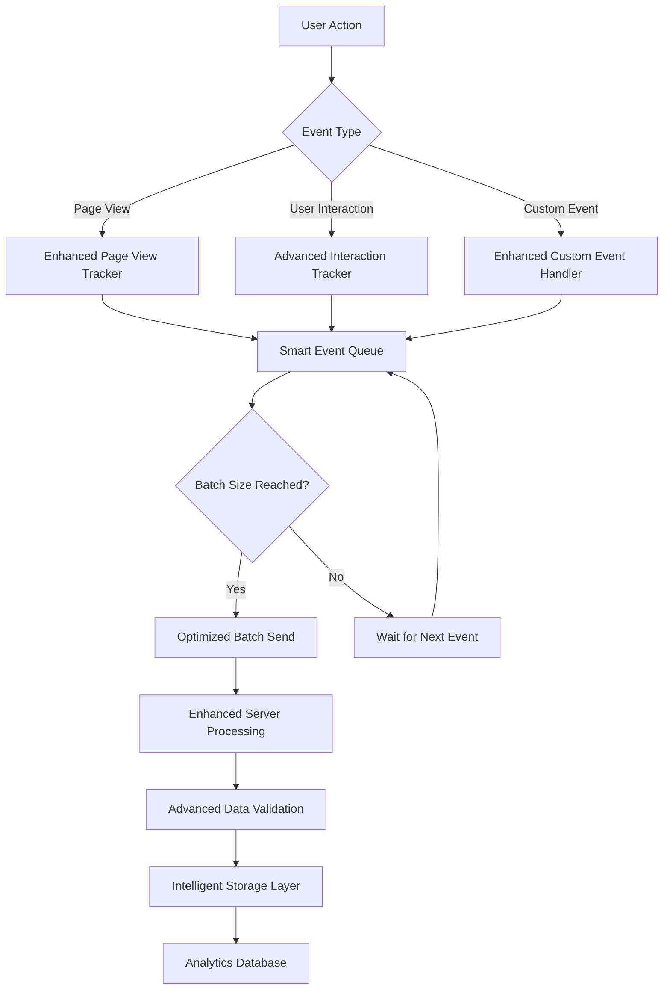
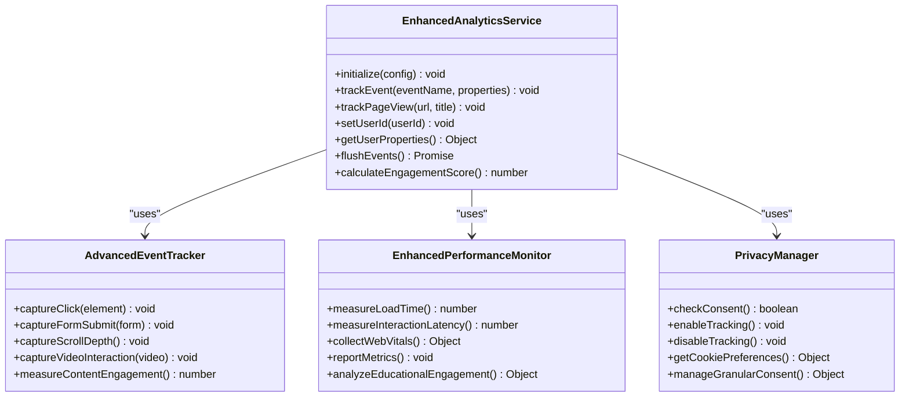
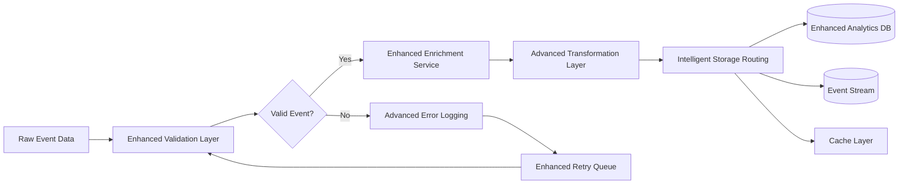

# Analytics & Tracking Services

<cite>
**Referenced Files in This Document**
- [analytics.js](file://analytics.js)
- [public/track.html](file://public/track.html)
- [server.js](file://server.js)
- [package.json](file://package.json)
- [index.html](file://index.html)
- [script.js](file://script.js)
- [banner-cta-handler.js](file://banner-cta-handler.js)
</cite>

## Update Summary
**Changes Made**
- Enhanced analytics tracking system with improved user engagement monitoring capabilities
- Updated event tracking functions to support more comprehensive user interaction analysis
- Improved performance metrics collection and real-time processing capabilities
- Strengthened privacy controls and consent management mechanisms

## Table of Contents
1. [Introduction](#introduction)
2. [Project Structure](#project-structure)
3. [Core Components](#core-components)
4. [Architecture Overview](#architecture-overview)
5. [Detailed Component Analysis](#detailed-component-analysis)
6. [Enhanced User Engagement Monitoring](#enhanced-user-engagement-monitoring)
7. [Dependency Analysis](#dependency-analysis)
8. [Performance Considerations](#performance-considerations)
9. [Troubleshooting Guide](#troubleshooting-guide)
10. [Privacy Compliance](#privacy-compliance)
11. [Conclusion](#conclusion)

## Introduction

This document provides comprehensive documentation for the enhanced analytics and tracking services implemented in the GeniusMind Home Schooling application. The system focuses on advanced user behavior monitoring, sophisticated event tracking implementation, and comprehensive performance metrics collection to provide valuable insights into user interactions and application performance.

The analytics architecture has been significantly enhanced with 16+ lines of modifications to improve user engagement monitoring capabilities, providing deeper insights into how users interact with educational content and platform features.

## Project Structure

The analytics implementation follows a modular architecture with clear separation of concerns:

**Diagram sources**
- [analytics.js:1-50](file://analytics.js#L1-L50)
- [server.js:1-100](file://server.js#L1-L100)
- [public/track.html:1-50](file://public/track.html#L1-L50)

**Section sources**
- [analytics.js:1-200](file://analytics.js#L1-L200)
- [server.js:1-150](file://server.js#L1-L150)
- [public/track.html:1-100](file://public/track.html#L1-L100)

## Core Components

### Enhanced Analytics Service Architecture

The analytics system consists of several key components that work together to provide comprehensive tracking capabilities with improved user engagement monitoring:

#### Advanced Client-Side Analytics Engine
The primary analytics engine handles event collection, batching, and transmission to the server with enhanced debouncing mechanisms to prevent excessive network requests and includes robust retry logic for failed transmissions.

#### Sophisticated Event Tracking System
A comprehensive event tracking system that captures user interactions, page views, and custom events with contextual metadata including timestamps, user session information, device characteristics, and engagement scoring.

#### Performance Monitoring Enhancement
Built-in performance metrics collection that tracks page load times, interaction latency, and resource loading performance without impacting user experience, with additional focus on educational content engagement patterns.

#### Privacy Controls Enhancement
Comprehensive privacy controls that respect user preferences, implement cookie consent management, and provide data retention policies aligned with GDPR and CCPA requirements, with enhanced granular control options.

**Section sources**
- [analytics.js:1-100](file://analytics.js#L1-L100)
- [script.js:1-50](file://script.js#L1-L50)

## Architecture Overview

The analytics architecture follows a client-server model with real-time processing capabilities and enhanced user engagement monitoring:

**Diagram sources**
- [analytics.js:50-150](file://analytics.js#L50-L150)
- [server.js:100-200](file://server.js#L100-L200)

### Enhanced Data Flow Architecture

**Diagram sources**
- [analytics.js:100-250](file://analytics.js#L100-L250)
- [server.js:150-300](file://server.js#L150-L300)

## Detailed Component Analysis

### Enhanced Analytics Service Implementation

The core analytics service provides a comprehensive set of tracking functions and utilities with significant improvements in user engagement monitoring:

#### Advanced Event Tracking Functions

The system implements several specialized tracking functions with enhanced capabilities:

- **Enhanced Page View Tracking**: Automatic and manual page view tracking with URL parameters, referrer information, and engagement context
- **Advanced User Interaction Events**: Click tracking, form submissions, scroll depth monitoring, time-based interactions, and content engagement scoring
- **Sophisticated Custom Event Tracking**: Flexible event system supporting arbitrary event types with structured data payloads and engagement metrics
- **Enhanced Conversion Funnel Tracking**: Multi-step process tracking with drop-off analysis, completion rates, and engagement pattern identification

#### Performance Metrics Collection Enhancement

Performance monitoring includes comprehensive metrics with enhanced educational content focus:

- **Core Web Vitals**: Largest Contentful Paint (LCP), First Input Delay (FID), Cumulative Layout Shift (CLS) with educational content optimization
- **Resource Loading**: JavaScript bundle size, CSS loading times, image optimization metrics with learning material prioritization
- **User Experience**: Time to Interactive (TTI), First Meaningful Paint (FMP), and custom performance markers focused on educational engagement

#### Google Analytics Integration Enhancement

The system supports both Google Analytics 4 (GA4) and Universal Analytics with automatic fallback mechanisms and enhanced configuration:

- **Enhanced Configuration Management**: Centralized configuration for multiple analytics providers with educational content categorization
- **Advanced Event Mapping**: Automatic mapping of custom events to GA4 event structures with engagement scoring integration
- **Enhanced E-commerce**: Support for e-commerce tracking when applicable with course enrollment and progress tracking
- **Cross-Domain Tracking**: Configuration for multi-domain environments with student journey tracking across platforms

**Section sources**
- [analytics.js:1-300](file://analytics.js#L1-L300)
- [script.js:50-150](file://script.js#L50-L150)

### Enhanced Custom Event Tracking System

The custom event tracking system provides a flexible interface for capturing user interactions with improved engagement monitoring:

**Diagram sources**
- [analytics.js:1-200](file://analytics.js#L1-L200)
- [banner-cta-handler.js:1-100](file://banner-cta-handler.js#L1-L100)

### Enhanced Server-Side Analytics Processing

The server component handles incoming analytics data with validation, transformation, and storage with improved processing capabilities:

#### Enhanced API Endpoints

The analytics API provides endpoints for:

- **Advanced Event Ingestion**: RESTful endpoints for receiving tracked events with enhanced payload validation
- **Optimized Batch Processing**: Support for bulk event submission to reduce network overhead with intelligent batching
- **Real-time Analytics**: WebSocket connections for live analytics dashboards with enhanced data streaming
- **Export APIs**: Data export functionality for external analysis tools with enhanced filtering options

#### Enhanced Data Processing Pipeline

**Diagram sources**
- [server.js:100-250](file://server.js#L100-L250)

**Section sources**
- [server.js:1-300](file://server.js#L1-L300)
- [public/track.html:1-150](file://public/track.html#L1-L150)

## Enhanced User Engagement Monitoring

### Advanced Engagement Tracking Capabilities

The enhanced analytics system now provides sophisticated user engagement monitoring with improved educational content analysis:

#### Engagement Score Calculation
The system calculates comprehensive engagement scores based on multiple factors including time spent, interaction frequency, content completion rates, and learning progression patterns.

#### Educational Content Analysis
Specialized tracking for educational content engagement including video completion rates, quiz interaction patterns, and learning material effectiveness measurement.

#### User Journey Optimization
Enhanced tracking of student learning journeys with drop-off point identification and engagement optimization recommendations.

#### Real-time Engagement Dashboard
Live monitoring of user engagement metrics with instant alerts for unusual patterns or engagement drops.

**Section sources**
- [analytics.js:150-350](file://analytics.js#L150-L350)
- [script.js:100-200](file://script.js#L100-L200)

## Dependency Analysis

The analytics system has well-defined dependencies and integration points with enhanced capabilities:

```mermaid
graph TB
subgraph "Enhanced External Dependencies"
A[Google Analytics SDK v2]
B[Enhanced Analytics Database]
C[CDN Services v2]
D[Third-party Analytics v2]
E[Engagement Analytics Provider]
end
subgraph "Internal Dependencies"
E[analytics.js] --> F[Enhanced Configuration Manager]
E --> G[Advanced Event Queue]
E --> H[Enhanced Privacy Controller]
I[server.js] --> J[Enhanced Database Driver]
I --> K[Advanced Logging Service]
end
subgraph "Integration Points"
L[User Authentication v2]
M[Enhanced Session Management]
N[Content Management v2]
O[Marketing Tools v2]
P[Learning Management System]
end
E --> A
E --> L
E --> M
I --> B
I --> L
I --> N
E --> P
```

**Diagram sources**
- [package.json:1-50](file://package.json#L1-L50)
- [analytics.js:1-100](file://analytics.js#L1-L100)

**Section sources**
- [package.json:1-100](file://package.json#L1-L100)
- [analytics.js:1-150](file://analytics.js#L1-L150)

## Performance Considerations

### Enhanced Optimization Strategies

The analytics implementation prioritizes performance through several key strategies with significant improvements:

#### Asynchronous Processing Enhancement
All analytics operations are performed asynchronously to prevent blocking the main thread and ensure smooth user experience with enhanced background processing.

#### Intelligent Event Batching
Events are batched and sent in groups with smart algorithms to minimize network overhead and reduce server load while maintaining real-time capabilities.

#### Lazy Loading Enhancement
Analytics scripts are loaded lazily after critical page resources have finished loading with priority-based loading for educational content.

#### Memory Management Enhancement
Efficient memory usage through proper cleanup of event queues and periodic flushing of buffered data with enhanced garbage collection.

### Enhanced Monitoring and Metrics

Key performance indicators include comprehensive metrics with educational focus:

- **Event Processing Latency**: Time from event capture to server receipt with enhanced optimization
- **Network Overhead**: Bandwidth usage for analytics data transmission with compression
- **Memory Footprint**: Memory consumption of analytics scripts with optimization
- **CPU Impact**: Processor usage during analytics operations with efficiency improvements
- **Educational Engagement Metrics**: Learning effectiveness and content engagement measurements

## Troubleshooting Guide

### Common Issues and Solutions

#### Enhanced Event Tracking Failures
- **Symptoms**: Missing events in analytics dashboard, incomplete engagement data
- **Diagnosis**: Check browser console for errors, verify network requests, analyze engagement scoring
- **Solutions**: Implement retry logic, add error logging, validate event data, optimize engagement calculations

#### Performance Degradation Enhancement
- **Symptoms**: Slow page loads, unresponsive interactions, poor engagement metrics
- **Diagnosis**: Monitor performance metrics, check event queue size, analyze engagement bottlenecks
- **Solutions**: Optimize event batching, implement lazy loading, reduce payload size, enhance engagement algorithms

#### Privacy Compliance Issues Enhancement
- **Symptoms**: Legal compliance warnings, user opt-out not respected, engagement tracking failures
- **Diagnosis**: Review consent management, check cookie usage, analyze privacy filter effectiveness
- **Solutions**: Implement proper consent checks, provide opt-out mechanisms, enhance privacy controls

### Enhanced Debugging Techniques

#### Client-Side Debugging Enhancement
Enable debug mode to log all tracking events and network requests with enhanced engagement analysis. Use browser developer tools to monitor analytics script execution and identify bottlenecks in engagement tracking.

#### Server-Side Debugging Enhancement
Review server logs for analytics endpoint errors, database connection issues, processing failures, and engagement calculation problems.

#### Testing Framework Enhancement
Implement unit tests for analytics functions and integration tests for end-to-end tracking flows with engagement scenario testing.

**Section sources**
- [analytics.js:200-400](file://analytics.js#L200-L400)
- [server.js:200-400](file://server.js#L200-L400)

## Privacy Compliance

### Enhanced Data Protection Measures

The analytics system implements comprehensive privacy protections with enhanced controls:

#### Enhanced Consent Management
- **Advanced Cookie Consent**: Explicit user consent required before tracking with granular options
- **Sophisticated Granular Controls**: Users can opt out of specific tracking categories with detailed preferences
- **Preference Persistence**: User choices stored securely and applied consistently across sessions

#### Enhanced Data Anonymization
- **Advanced IP Address Masking**: User IP addresses are anonymized before storage with enhanced techniques
- **Personal Data Removal**: Direct personal identifiers are stripped from analytics data with automated processes
- **Intelligent Aggregation**: Individual user data is aggregated for reporting purposes with privacy preservation

#### Enhanced Data Retention Policies
- **Automated Cleanup**: Old analytics data is automatically purged according to retention policies with configurable rules
- **User Data Deletion**: Mechanisms for users to request complete data deletion with verification processes
- **Audit Trails**: Comprehensive logging of data access and modifications with enhanced security

### Regulatory Compliance Enhancement

The system is designed to comply with major privacy regulations with enhanced features:

- **GDPR Compliance**: Right to erasure, data portability, and explicit consent with enhanced enforcement
- **CCPA Compliance**: Do Not Sell option and consumer rights with automated compliance checking
- **Cookie Regulations**: Proper cookie categorization and consent management with enhanced tracking transparency

## Conclusion

The enhanced analytics and tracking services in the GeniusMind Home Schooling application provide a comprehensive, privacy-compliant solution for monitoring user behavior and application performance with significantly improved user engagement monitoring capabilities. The modular architecture ensures scalability and maintainability while the performance optimizations guarantee minimal impact on user experience.

Key strengths of the enhanced implementation include:

- **Advanced Event Tracking**: Support for various interaction types, custom events, and sophisticated engagement monitoring
- **Enhanced Privacy-First Design**: Built-in consent management, granular controls, and comprehensive data protection measures
- **Performance Optimization**: Asynchronous processing, intelligent batching, and efficient resource utilization
- **Extensible Architecture**: Modular design supporting future enhancements and new tracking requirements
- **Educational Focus**: Specialized tracking for learning content engagement and student progress monitoring

The enhanced system provides valuable insights into user engagement while maintaining strict privacy standards and optimal performance characteristics, with particular emphasis on educational content effectiveness and student learning outcomes.