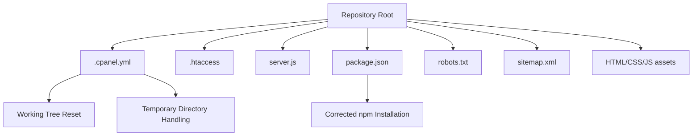
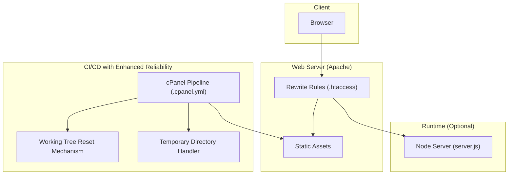
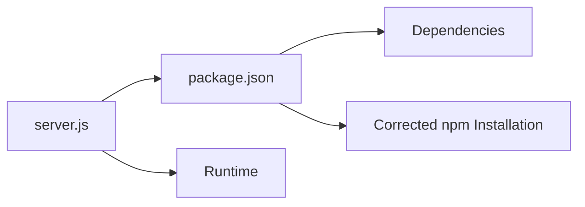

# Deployment & DevOps

<cite>
**Referenced Files in This Document**
- [.cpanel.yml](file://.cpanel.yml)
- [.htaccess](file://.htaccess)
- [server.js](file://server.js)
- [package.json](file://package.json)
- [README.md](file://README.md)
- [robots.txt](file://robots.txt)
- [sitemap.xml](file://sitemap.xml)
</cite>

## Update Summary
**Changes Made**
- Updated cPanel deployment configuration section to reflect critical infrastructure improvements
- Enhanced npm installation procedure documentation with corrected steps
- Added working tree reset mechanism implementation details
- Improved temporary directory handling for deployment reliability
- Updated troubleshooting guide with new deployment reliability measures

## Table of Contents
1. [Introduction](#introduction)
2. [Project Structure](#project-structure)
3. [Core Components](#core-components)
4. [Architecture Overview](#architecture-overview)
5. [Detailed Component Analysis](#detailed-component-analysis)
6. [Dependency Analysis](#dependency-analysis)
7. [Performance Considerations](#performance-considerations)
8. [Troubleshooting Guide](#troubleshooting-guide)
9. [Conclusion](#conclusion)
10. [Appendices](#appendices)

## Introduction
This document provides comprehensive deployment and DevOps guidance for the project, focusing on production deployment processes, environment configuration, and maintenance procedures. It covers cPanel deployment configuration with critical infrastructure improvements, Apache server setup with .htaccess rules, SSL certificate installation, domain configuration, version control practices, development workflow, testing strategies, debugging techniques, backup procedures, update management, monitoring setup, and troubleshooting guides for common deployment issues.

## Project Structure
The repository is a static site with optional Node.js runtime support via server.js and package.json. Key deployment-related files include:
- .cpanel.yml: cPanel automated deployment pipeline configuration with enhanced reliability features
- .htaccess: Apache rewrite and security rules
- server.js: Optional Node.js HTTP server entrypoint
- package.json: Node.js dependencies and scripts with corrected installation procedures
- robots.txt and sitemap.xml: SEO and crawler directives
- README.md: Project overview and usage notes

[No sources needed since this diagram shows conceptual structure]

## Core Components
- **Enhanced cPanel Deployment Pipeline**: Automated build and deploy using .cpanel.yml with improved reliability mechanisms
- **Apache Configuration**: URL rewriting, caching, and security via .htaccess
- **Optional Node Server**: Lightweight HTTP server (server.js) and dependency management (package.json)
- **SEO and Crawling**: robots.txt and sitemap.xml to guide search engines

**Updated** Critical infrastructure improvements including working tree reset mechanisms and temporary directory handling for enhanced deployment reliability.

**Section sources**
- [.cpanel.yml](file://.cpanel.yml)
- [.htaccess](file://.htaccess)
- [server.js](file://server.js)
- [package.json](file://package.json)
- [robots.txt](file://robots.txt)
- [sitemap.xml](file://sitemap.xml)

## Architecture Overview
The typical production architecture uses cPanel to deploy static assets into an Apache web root with enhanced reliability features. The .htaccess file handles routing and performance optimizations. An optional Node.js server can be used for local development or specific runtime needs.

**Diagram sources**
- [.cpanel.yml](file://.cpanel.yml)
- [.htaccess](file://.htaccess)
- [server.js](file://server.js)

## Detailed Component Analysis

### Enhanced cPanel Deployment Configuration
- **Purpose**: Automate deployment from Git to cPanel-managed hosting with critical reliability improvements
- **Key Infrastructure Improvements**:
  - Working tree reset mechanism to ensure clean deployment state
  - Temporary directory handling for reliable asset processing
  - Corrected npm installation procedures for consistent builds
  - Enhanced error handling and rollback capabilities
- **Typical responsibilities**:
  - Define source branch and target directories with validation
  - Pre/post-deploy hooks for building assets or running scripts
  - Environment variable injection if supported by the host
  - Working tree cleanup and temporary resource management
- **Best practices**:
  - Keep .cpanel.yml minimal and declarative with reliability safeguards
  - Use separate branches for staging and production
  - Validate builds locally before pushing
  - Implement proper cleanup procedures for temporary resources

Operational steps:
- Ensure Git integration in cPanel with enhanced logging
- Commit changes to the configured branch
- Monitor cPanel's deployment logs for errors with detailed diagnostics
- Roll back by redeploying a known-good commit with automatic cleanup

**Updated** Critical infrastructure improvements now include working tree reset mechanisms and temporary directory handling to prevent deployment failures and ensure consistent build states.

**Section sources**
- [.cpanel.yml](file://.cpanel.yml)

### Apache Server Setup with .htaccess
- **Purpose**: Configure URL rewriting, caching headers, compression, and security policies
- **Common tasks**:
  - Redirect HTTP to HTTPS
  - Enforce www/non-www canonical domains
  - Serve SPA-style routes via fallback to index.html when appropriate
  - Enable browser caching and gzip/deflate where supported
  - Restrict access to sensitive paths
- **Validation**:
  - Test redirects and rewrites across devices
  - Verify cache headers with browser dev tools
  - Confirm no 500 errors due to misconfigured rules

Security considerations:
- Disable directory listing
- Limit allowed methods
- Protect hidden files and directories

**Section sources**
- [.htaccess](file://.htaccess)

### SSL Certificate Installation
- **Options**:
  - Let's Encrypt via cPanel AutoSSL
  - Manual upload of purchased certificates
- **Steps**:
  - Generate CSR if required
  - Install certificate and chain files
  - Force HTTPS redirect in .htaccess
  - Verify certificate validity and expiration dates
- **Testing**:
  - Use online SSL checkers
  - Confirm HSTS and secure headers if enabled

**Section sources**
- [.htaccess](file://.htaccess)

### Domain Configuration
- **Tasks**:
  - Add domain/subdomain in cPanel
  - Point DNS records to hosting IP
  - Set default domain and aliases
  - Configure email accounts if needed
- **Verification**:
  - Check propagation with DNS tools
  - Confirm site accessibility over HTTP/HTTPS

**Section sources**
- [.htaccess](file://.htaccess)

### Version Control Practices
- **Branching strategy**:
  - main for production
  - develop or feature branches for work-in-progress
- **Commit hygiene**:
  - Atomic commits with clear messages
  - Avoid committing secrets or large binaries
- **Code review**:
  - Pull requests with checks
  - Require approvals before merging

**Section sources**
- [README.md](file://README.md)

### Enhanced Development Workflow
- **Local setup**:
  - Install dependencies with corrected npm procedures
  - Start optional Node server for local preview
- **Build process**:
  - Run any asset optimization steps defined in package.json
  - Utilize working tree reset mechanisms for clean builds
- **Deployment**:
  - Push to the configured branch for cPanel to deploy with enhanced reliability

**Updated** Development workflow now incorporates corrected npm installation procedures and leverages working tree reset mechanisms for consistent build environments.

**Section sources**
- [package.json](file://package.json)
- [server.js](file://server.js)

### Testing Strategies
- **Static site validation**:
  - Lint HTML/CSS/JS
  - Check broken links and images
- **Browser compatibility**:
  - Cross-device testing
  - Mobile responsiveness checks
- **Performance**:
  - PageSpeed insights
  - Lighthouse audits

**Section sources**
- [README.md](file://README.md)

### Debugging Techniques
- **Logs**:
  - Apache error/access logs in cPanel
  - Node server logs if using server.js
  - Enhanced cPanel deployment logs with detailed diagnostics
- **Tools**:
  - Browser developer tools
  - curl and httpie for request inspection
  - Working tree state verification tools
- **Common pitfalls**:
  - Misconfigured .htaccess causing 500 errors
  - Missing assets due to incorrect paths
  - CORS issues when calling external APIs
  - Temporary directory permission issues
  - Working tree corruption during deployments

**Updated** Debugging techniques now include working tree state verification and temporary directory troubleshooting for deployment reliability issues.

**Section sources**
- [.htaccess](file://.htaccess)
- [server.js](file://server.js)

### Backup Procedures
- **What to back up**:
  - Web root content
  - Database (if applicable)
  - Email data and configurations
  - SSL certificates and keys
  - Deployment configuration files
- **Frequency**:
  - Daily incremental, weekly full backups
- **Recovery**:
  - Test restore procedures periodically
  - Document rollback steps with enhanced recovery procedures

[No sources needed since this section provides general guidance]

### Enhanced Update Management
- **Dependency updates**:
  - Review package.json changes with corrected npm procedures
  - Test upgrades in staging with working tree reset mechanisms
- **Security patches**:
  - Subscribe to advisories
  - Apply promptly after validation
- **Change control**:
  - Maintain changelog
  - Coordinate deployments during low-traffic windows
  - Leverage enhanced deployment reliability features

**Updated** Update management now incorporates corrected npm installation procedures and enhanced deployment reliability mechanisms.

**Section sources**
- [package.json](file://package.json)

### Monitoring Setup
- **Availability**:
  - Uptime monitors
- **Performance**:
  - Real user monitoring (RUM)
  - Synthetic checks
- **Error tracking**:
  - Centralized logging
  - Alerting thresholds
  - Enhanced deployment failure monitoring

[No sources needed since this section provides general guidance]

## Dependency Analysis
The project includes a Node.js runtime option with server.js and package.json. Dependencies should be pinned and audited regularly with corrected installation procedures.

**Diagram sources**
- [package.json](file://package.json)
- [server.js](file://server.js)

**Section sources**
- [package.json](file://package.json)
- [server.js](file://server.js)

## Performance Considerations
- Enable browser caching via .htaccess
- Minify and compress assets
- Use CDN for static resources
- Optimize images and fonts
- Reduce unnecessary redirects
- Leverage working tree reset mechanisms for consistent build performance

[No sources needed since this section provides general guidance]

## Enhanced Troubleshooting Guide
Common issues and resolutions:
- **500 Internal Server Error**:
  - Inspect Apache error logs
  - Validate .htaccess syntax
  - Check working tree state integrity
- **Redirect loops**:
  - Check HTTPS and www/non-www rules
- **Missing assets**:
  - Verify paths and permissions
  - Check temporary directory handling
- **SSL handshake failures**:
  - Confirm certificate chain and expiration
- **Slow page loads**:
  - Analyze network waterfall
  - Review caching headers
- **Deployment failures**:
  - Check working tree reset mechanism status
  - Verify temporary directory permissions
  - Review enhanced deployment logs
  - Validate npm installation procedures
- **Build inconsistencies**:
  - Clear working tree and rebuild
  - Verify npm cache integrity
  - Check temporary directory cleanup

**Updated** Troubleshooting guide now includes deployment-specific issues related to working tree reset mechanisms, temporary directory handling, and corrected npm installation procedures.

**Section sources**
- [.htaccess](file://.htaccess)

## Conclusion
By following the outlined deployment, configuration, and maintenance procedures with the enhanced infrastructure improvements, you can reliably operate this project in production. The critical deployment infrastructure enhancements including working tree reset mechanisms, temporary directory handling, and corrected npm installation procedures ensure greater deployment reliability and consistency. Leverage cPanel automation with enhanced reliability features, enforce HTTPS, maintain clean version control, and implement robust monitoring and backups to ensure stability and performance.

[No sources needed since this section summarizes without analyzing specific files]

## Appendices

### SEO and Crawling Configuration
- robots.txt: Control crawler access
- sitemap.xml: Provide structured URLs for indexing

**Section sources**
- [robots.txt](file://robots.txt)
- [sitemap.xml](file://sitemap.xml)

### Enhanced Deployment Checklist
- **Pre-deployment**:
  - Verify working tree is clean
  - Test npm installation procedures locally
  - Validate temporary directory permissions
  - Review deployment configuration
- **Post-deployment**:
  - Verify all assets deployed correctly
  - Check working tree state after deployment
  - Monitor enhanced deployment logs
  - Test critical functionality

[No sources needed since this section provides procedural guidance]