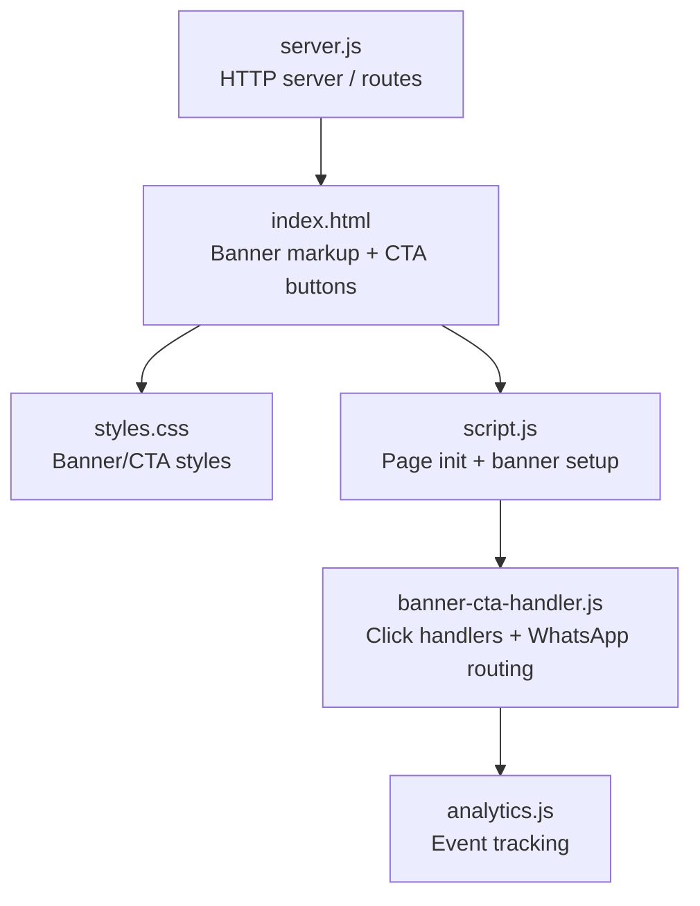
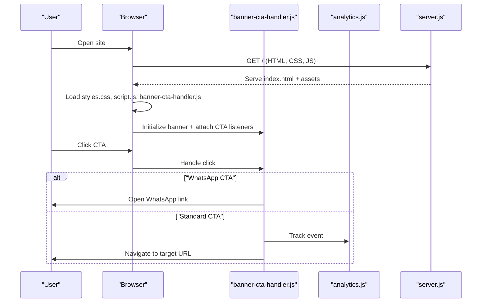
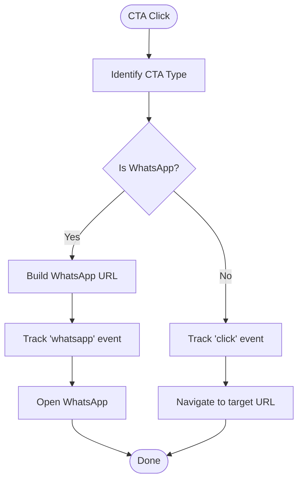
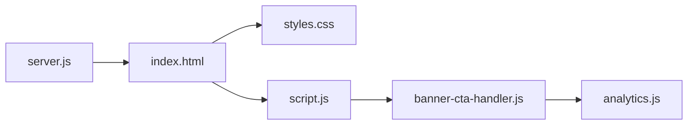

# Banner & CTA System

<cite>
**Referenced Files in This Document**
- [banner-cta-handler.js](file://banner-cta-handler.js)
- [index.html](file://index.html)
- [script.js](file://script.js)
- [styles.css](file://styles.css)
- [server.js](file://server.js)
- [analytics.js](file://analytics.js)
- [README.md](file://README.md)
</cite>

## Table of Contents
1. [Introduction](#introduction)
2. [Project Structure](#project-structure)
3. [Core Components](#core-components)
4. [Architecture Overview](#architecture-overview)
5. [Detailed Component Analysis](#detailed-component-analysis)
6. [Dependency Analysis](#dependency-analysis)
7. [Performance Considerations](#performance-considerations)
8. [Troubleshooting Guide](#troubleshooting-guide)
9. [Conclusion](#conclusion)

## Introduction
This document describes the Banner and Call-to-Action (CTA) system implemented across the site. It explains how banners are rendered, how CTAs are wired to analytics and external services, and how server-side logic supports tracking and delivery. The goal is to provide a clear, code-mapped understanding for developers and content editors who manage banners and CTAs.

## Project Structure
The banner and CTA functionality spans client-side HTML/CSS/JS, a small server component, and analytics integration:
- Client UI: index.html includes banner markup and CTA elements; styles.css provides visual styling; script.js initializes behaviors; banner-cta-handler.js centralizes CTA click handling and optional WhatsApp routing.
- Server: server.js serves pages and can be extended to support dynamic banner data or logging.
- Analytics: analytics.js integrates with site-wide analytics for CTA event tracking.

**Diagram sources**
- [index.html](file://index.html)
- [styles.css](file://styles.css)
- [script.js](file://script.js)
- [banner-cta-handler.js](file://banner-cta-handler.js)
- [analytics.js](file://analytics.js)
- [server.js](file://server.js)

**Section sources**
- [README.md](file://README.md)

## Core Components
- Banner UI and Styling: Defined in the main page and styled via CSS. Banners typically include a headline, description, and one or more CTA buttons.
- CTA Click Handling: Centralized in banner-cta-handler.js to ensure consistent behavior across all CTAs, including optional WhatsApp redirection and analytics events.
- Page Initialization: script.js wires up DOM-ready tasks such as attaching listeners and initializing banner state.
- Analytics Integration: analytics.js records CTA interactions for measurement and optimization.
- Server Support: server.js hosts the application and can be extended to serve dynamic banner content or log CTA events.

Key responsibilities:
- Render banners consistently across devices.
- Provide accessible, trackable CTAs.
- Route specific CTAs to WhatsApp when configured.
- Emit analytics events on user actions.

**Section sources**
- [index.html](file://index.html)
- [styles.css](file://styles.css)
- [script.js](file://script.js)
- [banner-cta-handler.js](file://banner-cta-handler.js)
- [analytics.js](file://analytics.js)
- [server.js](file://server.js)

## Architecture Overview
The system follows a simple client-server model with modular JavaScript:
- The browser loads index.html, which references styles.css, script.js, and banner-cta-handler.js.
- On page load, script.js sets up banner components and delegates CTA clicks to banner-cta-handler.js.
- banner-cta-handler.js performs actions like opening links, redirecting to WhatsApp, and firing analytics events via analytics.js.
- server.js serves static assets and can be extended for backend features.

**Diagram sources**
- [index.html](file://index.html)
- [styles.css](file://styles.css)
- [script.js](file://script.js)
- [banner-cta-handler.js](file://banner-cta-handler.js)
- [analytics.js](file://analytics.js)
- [server.js](file://server.js)

## Detailed Component Analysis

### Banner Markup and Styling
- Purpose: Define banner structure and appearance, ensuring responsive design and accessibility.
- Key aspects:
  - Semantic HTML for headings, paragraphs, and buttons.
  - CSS classes for layout, spacing, colors, and mobile breakpoints.
  - Optional background images or gradients controlled by CSS variables or utility classes.

Best practices:
- Use descriptive class names tied to banner sections.
- Ensure sufficient color contrast for readability.
- Keep media queries minimal and targeted.

**Section sources**
- [index.html](file://index.html)
- [styles.css](file://styles.css)

### CTA Click Handler
- Purpose: Centralize all CTA behaviors to avoid duplication and ensure consistent tracking and navigation.
- Responsibilities:
  - Detect CTA clicks within banners.
  - Determine action type (e.g., standard link vs. WhatsApp).
  - Fire analytics events before navigation.
  - Perform safe redirects or open new tabs where appropriate.

Implementation patterns:
- Event delegation on container elements to handle dynamically added CTAs.
- Configuration-driven behavior using data attributes or settings objects.
- Error-safe navigation that preserves analytics events even if the destination fails.

**Diagram sources**
- [banner-cta-handler.js](file://banner-cta-handler.js)
- [analytics.js](file://analytics.js)

**Section sources**
- [banner-cta-handler.js](file://banner-cta-handler.js)
- [analytics.js](file://analytics.js)

### Page Initialization and Wiring
- Purpose: Bootstrap banner components and attach global listeners.
- Responsibilities:
  - Wait for DOM ready.
  - Locate banner containers and CTA elements.
  - Register click handlers through banner-cta-handler.js.
  - Apply initial states (e.g., show/hide banners based on configuration).

Reliability considerations:
- Guard against missing elements.
- Debounce or throttle heavy operations if needed.
- Ensure initialization runs once per page lifecycle.

**Section sources**
- [script.js](file://script.js)
- [banner-cta-handler.js](file://banner-cta-handler.js)

### Analytics Integration
- Purpose: Record CTA interactions for measurement and optimization.
- Responsibilities:
  - Emit standardized events with labels (e.g., banner name, CTA label).
  - Avoid duplicate tracking on repeated clicks.
  - Gracefully handle cases where analytics libraries are not available.

Integration points:
- Called from banner-cta-handler.js upon CTA clicks.
- Can be extended to capture additional metadata (e.g., device type, time).

**Section sources**
- [analytics.js](file://analytics.js)
- [banner-cta-handler.js](file://banner-cta-handler.js)

### Server-Side Support
- Purpose: Host the site and optionally extend functionality for banners and CTAs.
- Capabilities:
  - Serve static files (HTML, CSS, JS).
  - Add endpoints for logging CTA events or serving dynamic banner configurations.
  - Integrate with third-party services if required.

Extensibility:
- Add a route to receive analytics payloads.
- Implement feature flags to toggle banners per environment.

**Section sources**
- [server.js](file://server.js)

## Dependency Analysis
Client-side dependencies form a clear chain:
- index.html depends on styles.css, script.js, and banner-cta-handler.js.
- script.js orchestrates initialization and delegates to banner-cta-handler.js.
- banner-cta-handler.js depends on analytics.js for event emission.
- server.js serves these assets and can be extended for backend integrations.

**Diagram sources**
- [index.html](file://index.html)
- [styles.css](file://styles.css)
- [script.js](file://script.js)
- [banner-cta-handler.js](file://banner-cta-handler.js)
- [analytics.js](file://analytics.js)
- [server.js](file://server.js)

**Section sources**
- [index.html](file://index.html)
- [styles.css](file://styles.css)
- [script.js](file://script.js)
- [banner-cta-handler.js](file://banner-cta-handler.js)
- [analytics.js](file://analytics.js)
- [server.js](file://server.js)

## Performance Considerations
- Minimize reflows: Batch DOM updates when configuring multiple banners.
- Defer non-critical scripts: Load analytics after primary content renders.
- Optimize images: Use responsive images and compression for banner backgrounds.
- Reduce event overhead: Use event delegation instead of per-element listeners.
- Cache assets: Rely on browser caching and CDN distribution for faster loads.

[No sources needed since this section provides general guidance]

## Troubleshooting Guide
Common issues and resolutions:
- CTA clicks not tracked:
  - Verify analytics.js is loaded before handler calls.
  - Check console for errors during event emission.
  - Ensure handler is attached after DOM readiness.
- WhatsApp redirection failing:
  - Validate phone number format and message encoding.
  - Confirm HTTPS context if required by the platform.
- Banners not visible:
  - Inspect CSS rules and media queries for overrides.
  - Confirm container elements exist and have correct classes.
- Inconsistent behavior across devices:
  - Test on mobile viewports and adjust breakpoints.
  - Ensure touch targets meet minimum size guidelines.

**Section sources**
- [banner-cta-handler.js](file://banner-cta-handler.js)
- [analytics.js](file://analytics.js)
- [styles.css](file://styles.css)
- [script.js](file://script.js)

## Conclusion
The Banner & CTA System provides a robust, maintainable foundation for presenting promotional content and driving user actions. By centralizing CTA logic, integrating analytics, and keeping styling modular, the system ensures consistency, measurability, and ease of extension. Future enhancements can include server-driven banner configuration, richer event payloads, and advanced A/B testing hooks.

[No sources needed since this section summarizes without analyzing specific files]