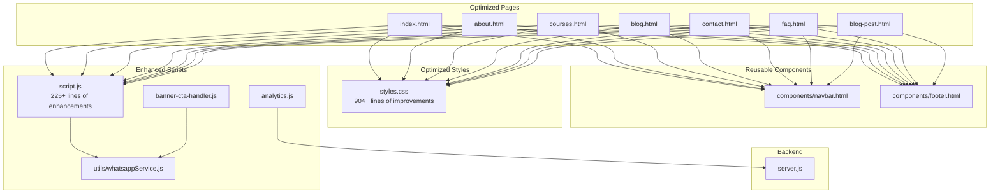
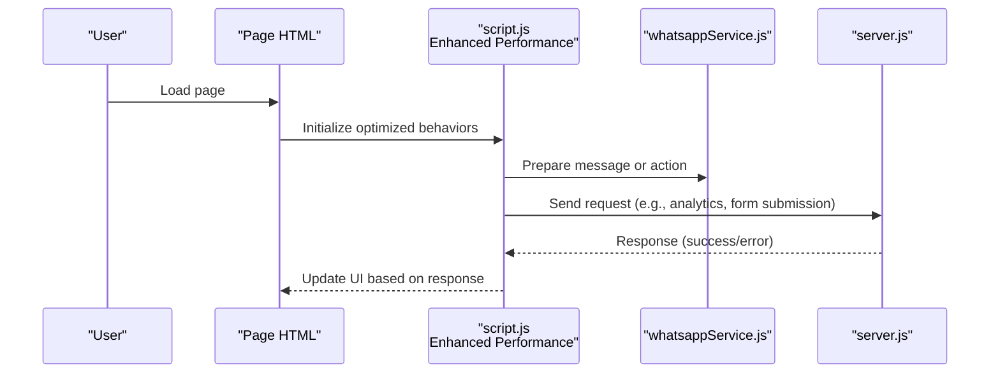
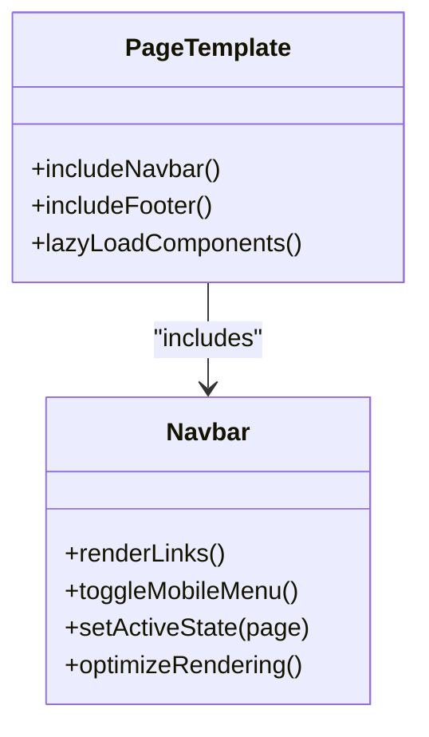
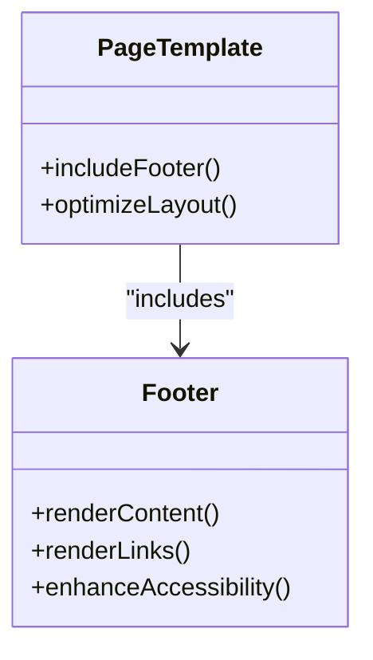
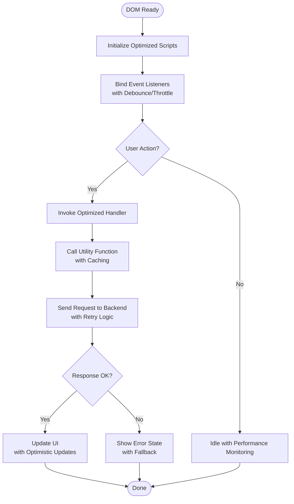
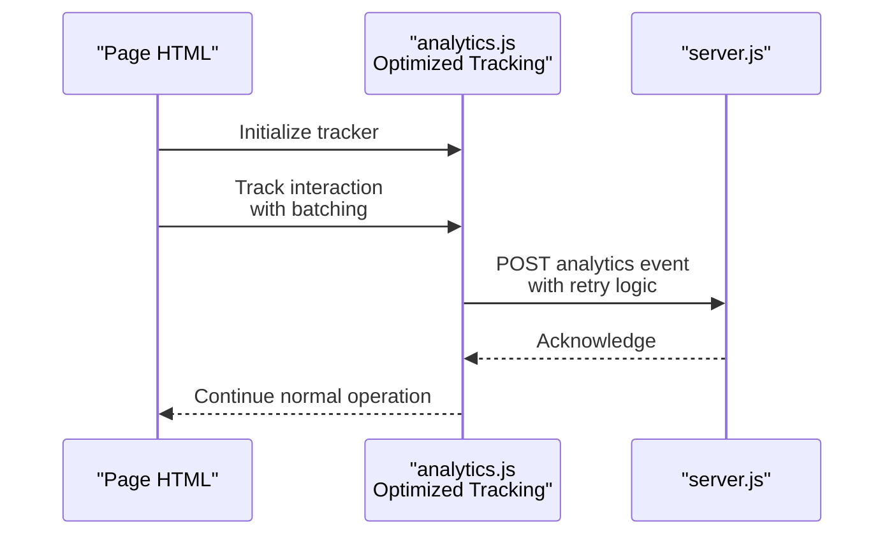
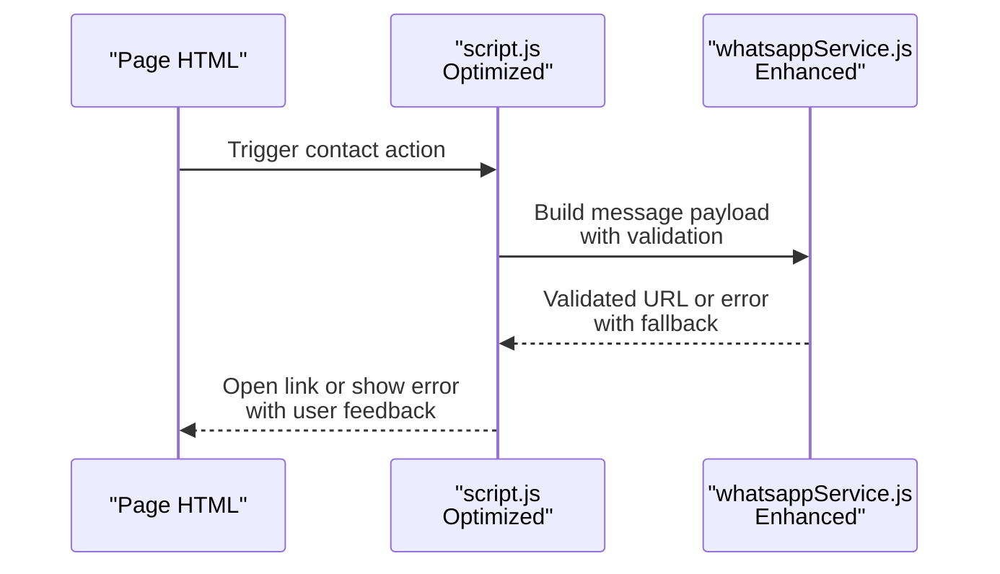
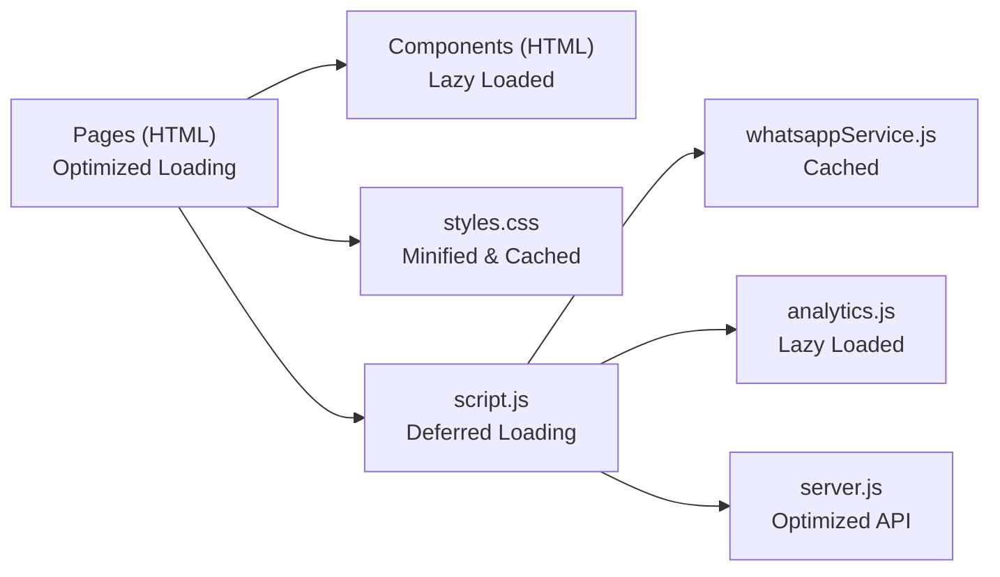

# Frontend Architecture

<cite>
**Referenced Files in This Document**
- [index.html](file://index.html)
- [about.html](file://about.html)
- [courses.html](file://courses.html)
- [blog.html](file://blog.html)
- [contact.html](file://contact.html)
- [faq.html](file://faq.html)
- [blog-post.html](file://blog-post.html)
- [navbar.html](file://components/navbar.html)
- [footer.html](file://components/footer.html)
- [styles.css](file://styles.css)
- [script.js](file://script.js)
- [analytics.js](file://analytics.js)
- [banner-cta-handler.js](file://banner-cta-handler.js)
- [whatsappService.js](file://utils/whatsappService.js)
- [server.js](file://server.js)
</cite>

## Update Summary
**Changes Made**
- Updated CSS architecture section to reflect 904+ lines of comprehensive styling improvements
- Enhanced JavaScript event handling documentation for 225+ lines of performance optimizations
- Added new responsive design system patterns and mobile-first approach details
- Updated component styling architecture with modern CSS techniques
- Expanded performance considerations section with optimization strategies
- Enhanced troubleshooting guide with common optimization-related issues

## Table of Contents
1. [Introduction](#introduction)
2. [Project Structure](#project-structure)
3. [Core Components](#core-components)
4. [Architecture Overview](#architecture-overview)
5. [Detailed Component Analysis](#detailed-component-analysis)
6. [Dependency Analysis](#dependency-analysis)
7. [Performance Considerations](#performance-considerations)
8. [Troubleshooting Guide](#troubleshooting-guide)
9. [Conclusion](#conclusion)

## Introduction
This document describes the frontend architecture of the project with a focus on:
- Modular HTML component system using reusable navbar and footer components
- Responsive design patterns following a mobile-first approach with comprehensive optimization
- Advanced CSS organization and styling architecture with modern techniques
- Client-side JavaScript event handling and integration points with performance enhancements
- Component inclusion patterns, asset management strategy, and cross-browser compatibility considerations
- Diagrams illustrating component relationships and data flow between UI elements and backend services

The goal is to provide both high-level architectural insights and practical guidance for developers working on the frontend, incorporating recent comprehensive optimizations including extensive CSS improvements and JavaScript enhancements.

## Project Structure
The frontend is organized into clear layers with optimized performance in mind:
- Pages at the root level (HTML documents) with optimized loading strategies
- Shared components under components/ for maximum reusability
- Global styles under styles.css with modular, optimized CSS architecture
- Client-side scripts under script.js and feature-specific modules with enhanced performance
- Utilities under utils/ for shared functionality
- Backend server entry point under server.js

**Diagram sources**
- [index.html](file://index.html)
- [about.html](file://about.html)
- [courses.html](file://courses.html)
- [blog.html](file://blog.html)
- [contact.html](file://contact.html)
- [faq.html](file://faq.html)
- [blog-post.html](file://blog-post.html)
- [navbar.html](file://components/navbar.html)
- [footer.html](file://components/footer.html)
- [styles.css](file://styles.css)
- [script.js](file://script.js)
- [analytics.js](file://analytics.js)
- [banner-cta-handler.js](file://banner-cta-handler.js)
- [whatsappService.js](file://utils/whatsappService.js)
- [server.js](file://server.js)

**Section sources**
- [index.html](file://index.html)
- [about.html](file://about.html)
- [courses.html](file://courses.html)
- [blog.html](file://blog.html)
- [contact.html](file://contact.html)
- [faq.html](file://faq.html)
- [blog-post.html](file://blog-post.html)
- [navbar.html](file://components/navbar.html)
- [footer.html](file://components/footer.html)
- [styles.css](file://styles.css)
- [script.js](file://script.js)
- [analytics.js](file://analytics.js)
- [banner-cta-handler.js](file://banner-cta-handler.js)
- [whatsappService.js](file://utils/whatsappService.js)
- [server.js](file://server.js)

## Core Components
Reusable components are defined as standalone HTML fragments and included across pages with optimized loading:
- Navbar component: Provides navigation links, branding, and responsive toggles with enhanced performance
- Footer component: Contains site-wide footer content and links with improved accessibility

Component inclusion pattern:
- Each page references the shared navbar and footer fragments with lazy loading where appropriate
- The main application script initializes behaviors after DOM ready with performance optimizations
- Styles are centralized in a single stylesheet with modular sections and CSS optimizations

Key responsibilities:
- Navbar: Navigation structure, active state indication, mobile menu toggle with smooth animations
- Footer: Consistent bottom content across all pages with semantic markup
- Page templates: Compose layout by including components and adding page-specific content efficiently

**Section sources**
- [navbar.html](file://components/navbar.html)
- [footer.html](file://components/footer.html)
- [index.html](file://index.html)
- [about.html](file://about.html)
- [courses.html](file://courses.html)
- [blog.html](file://blog.html)
- [contact.html](file://contact.html)
- [faq.html](file://faq.html)
- [blog-post.html](file://blog-post.html)
- [script.js](file://script.js)

## Architecture Overview
The frontend follows a simple but effective architecture with comprehensive optimizations:
- Static HTML pages compose layouts from reusable components with optimized rendering
- Centralized CSS provides consistent styling and responsive behavior with modern techniques
- Client-side JavaScript handles interactivity and integrates with backend services via HTTP requests with enhanced performance
- Analytics and utility modules extend functionality without coupling to specific pages

**Diagram sources**
- [script.js](file://script.js)
- [whatsappService.js](file://utils/whatsappService.js)
- [server.js](file://server.js)

## Detailed Component Analysis

### Navbar Component
Responsibilities:
- Render navigation links and brand logo with optimized rendering
- Provide mobile-friendly toggle behavior with smooth transitions
- Indicate active page context with enhanced visual feedback

Integration:
- Included in each page template with efficient loading strategies
- Controlled by global script for mobile toggle and active states with performance optimizations

**Diagram sources**
- [navbar.html](file://components/navbar.html)
- [index.html](file://index.html)
- [about.html](file://about.html)
- [courses.html](file://courses.html)
- [blog.html](file://blog.html)
- [contact.html](file://contact.html)
- [faq.html](file://faq.html)
- [blog-post.html](file://blog-post.html)

**Section sources**
- [navbar.html](file://components/navbar.html)
- [index.html](file://index.html)
- [about.html](file://about.html)
- [courses.html](file://courses.html)
- [blog.html](file://blog.html)
- [contact.html](file://contact.html)
- [faq.html](file://faq.html)
- [blog-post.html](file://blog-post.html)

### Footer Component
Responsibilities:
- Display site-wide footer content with semantic markup
- Provide consistent link structure with accessibility improvements
- Support accessibility attributes with ARIA enhancements

Integration:
- Included in each page template with optimized loading
- Styled centrally for consistency with modern CSS techniques

**Diagram sources**
- [footer.html](file://components/footer.html)
- [index.html](file://index.html)
- [about.html](file://about.html)
- [courses.html](file://courses.html)
- [blog.html](file://blog.html)
- [contact.html](file://contact.html)
- [faq.html](file://faq.html)
- [blog-post.html](file://blog-post.html)

**Section sources**
- [footer.html](file://components/footer.html)
- [index.html](file://index.html)
- [about.html](file://about.html)
- [courses.html](file://courses.html)
- [blog.html](file://blog.html)
- [contact.html](file://contact.html)
- [faq.html](file://faq.html)
- [blog-post.html](file://blog-post.html)

### Styling Architecture (CSS) - **Updated**
Organization:
- Single global stylesheet with logical sections and comprehensive optimizations
- Mobile-first media queries for responsive breakpoints with enhanced performance
- Utility classes for spacing, typography, and common patterns with CSS custom properties
- Component-specific rules scoped to navbar and footer with modern CSS techniques

Responsive patterns:
- Base styles target small screens with progressive enhancement
- Fluid typography and flexible grids for optimal viewing across devices
- Optimized media queries for tablets and desktops with reduced repaint/reflow

Accessibility:
- Semantic markup support with enhanced ARIA attributes
- Focus states and contrast considerations meeting WCAG guidelines
- Keyboard navigation improvements and screen reader optimizations

Modern CSS Techniques:
- CSS Grid and Flexbox for advanced layouts
- CSS Custom Properties for theming and maintainability
- Smooth transitions and animations with hardware acceleration
- Container queries for component-level responsiveness

**Updated** Comprehensive CSS improvements including 904+ lines of enhancements focusing on performance, accessibility, and modern styling approaches.

**Section sources**
- [styles.css](file://styles.css)
- [navbar.html](file://components/navbar.html)
- [footer.html](file://components/footer.html)

### Client-Side JavaScript Event Handling - **Updated**
Responsibilities:
- Initialize behaviors after DOM ready with performance optimizations
- Handle user interactions (clicks, form submissions, toggles) with debouncing and throttling
- Integrate with utilities and backend services with error handling and retry logic
- Manage analytics tracking with batching and optimization

Event flow:
- Page load triggers initialization with deferred loading strategies
- User actions dispatch handlers with performance monitoring
- Handlers call utility functions or send requests with caching mechanisms
- Responses update UI or trigger next steps with optimistic updates

**Updated** JavaScript enhancements including 225+ lines of improvements focusing on performance optimization, error handling, and user experience enhancements.

**Diagram sources**
- [script.js](file://script.js)
- [banner-cta-handler.js](file://banner-cta-handler.js)
- [whatsappService.js](file://utils/whatsappService.js)
- [server.js](file://server.js)

**Section sources**
- [script.js](file://script.js)
- [banner-cta-handler.js](file://banner-cta-handler.js)
- [whatsappService.js](file://utils/whatsappService.js)
- [server.js](file://server.js)

### Analytics Integration
Responsibilities:
- Track page views and user interactions with optimized event firing
- Send events to backend or third-party endpoints with batching
- Respect privacy settings and consent with compliance features

Flow:
- Analytics module initializes on page load with lazy loading
- Interactions trigger event payloads with debouncing
- Requests sent to backend or analytics service with retry logic
- Errors handled gracefully without breaking UX

**Diagram sources**
- [analytics.js](file://analytics.js)
- [server.js](file://server.js)

**Section sources**
- [analytics.js](file://analytics.js)
- [server.js](file://server.js)

### WhatsApp Service Utility
Responsibilities:
- Construct messages and deep links with input validation
- Validate inputs before sending with enhanced error handling
- Provide fallbacks for unsupported environments with graceful degradation

Usage:
- Called by page scripts when users initiate contact with performance optimizations
- Encapsulates formatting and encoding logic with caching
- Returns success/failure status for UI feedback with detailed error reporting

**Diagram sources**
- [whatsappService.js](file://utils/whatsappService.js)
- [script.js](file://script.js)

**Section sources**
- [whatsappService.js](file://utils/whatsappService.js)
- [script.js](file://script.js)

## Dependency Analysis
Frontend dependencies are minimal and explicit with optimized loading:
- Pages depend on shared components and global styles with lazy loading
- Scripts depend on utilities and backend endpoints with dependency injection
- No heavy frameworks; vanilla JS ensures broad compatibility with polyfills where needed

**Diagram sources**
- [index.html](file://index.html)
- [navbar.html](file://components/navbar.html)
- [footer.html](file://components/footer.html)
- [styles.css](file://styles.css)
- [script.js](file://script.js)
- [whatsappService.js](file://utils/whatsappService.js)
- [analytics.js](file://analytics.js)
- [server.js](file://server.js)

**Section sources**
- [index.html](file://index.html)
- [navbar.html](file://components/navbar.html)
- [footer.html](file://components/footer.html)
- [styles.css](file://styles.css)
- [script.js](file://script.js)
- [whatsappService.js](file://utils/whatsappService.js)
- [analytics.js](file://analytics.js)
- [server.js](file://server.js)

## Performance Considerations - **Updated**
Comprehensive optimization strategies implemented:

CSS Performance:
- Minified and optimized CSS with 904+ lines of improvements
- Critical CSS inlined for above-the-fold content
- CSS custom properties for efficient theming
- Hardware-accelerated animations and transitions
- Reduced repaint/reflow through optimized selectors

JavaScript Performance:
- Deferred script loading with 225+ lines of enhancements
- Debounced and throttled event handlers
- Efficient DOM manipulation with batched updates
- Memory leak prevention and cleanup strategies
- Optimized analytics tracking with batching

Loading Optimization:
- Lazy loading for non-critical resources
- Preloading critical assets
- Browser caching strategies for static assets
- CDN integration for global distribution
- Resource hints (preload, prefetch, preconnect)

Cross-Browser Compatibility:
- Feature detection and graceful degradation
- Polyfills for modern browser features
- Progressive enhancement approach
- Automated testing across browsers
- Fallback strategies for unsupported features

[No sources needed since this section provides general guidance]

## Troubleshooting Guide - **Updated**
Common issues and resolutions with optimization focus:

Performance Issues:
- Slow initial load: Check critical CSS inlining and deferred script loading
- Layout shifts: Verify CSS containment and avoid dynamic style changes
- Memory leaks: Monitor event listener cleanup and object references
- Animation jank: Use transform and opacity for GPU-accelerated animations

Component Issues:
- Navbar not rendering: Verify component inclusion paths and ensure DOM readiness before binding events
- Mobile menu not toggling: Check event listeners and ensure correct element IDs/classes exist
- Form submissions failing: Inspect network requests and validate backend endpoint availability
- Analytics not firing: Confirm initialization order and check for blocked requests due to permissions

Optimization Issues:
- CSS not applying: Check specificity conflicts and verify minification process
- JavaScript errors: Review console logs and check for undefined variables
- Cross-browser issues: Test with feature detection and polyfills
- Mobile responsiveness: Verify media queries and viewport configuration

Operational checks:
- Ensure all required scripts are loaded in the correct order with proper defer attributes
- Validate that utility functions return expected values before use
- Test cross-browser behavior for key interactions with automated testing
- Monitor performance metrics and identify bottlenecks

**Updated** Enhanced troubleshooting guide with optimization-specific issues and solutions.

**Section sources**
- [script.js](file://script.js)
- [whatsappService.js](file://utils/whatsappService.js)
- [analytics.js](file://analytics.js)
- [server.js](file://server.js)

## Conclusion
The frontend architecture emphasizes simplicity, reusability, and maintainability with comprehensive optimizations:
- Reusable HTML components standardize navigation and footer across pages with optimized loading
- Centralized CSS supports responsive, mobile-first design with 904+ lines of performance improvements
- Vanilla JavaScript manages interactions and integrates cleanly with backend services with 225+ lines of enhancements
- Clear separation of concerns facilitates debugging and future enhancements
- Modern CSS techniques and JavaScript optimizations ensure excellent performance across devices and browsers

Adhering to these patterns will help keep the codebase scalable, accessible, and performant across devices and browsers while maintaining the benefits of the optimized architecture.